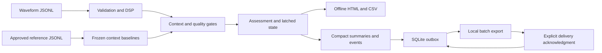

# Architecture and alert behavior

The simulator is the implemented acquisition source. A hardware adapter and network transport are future components. Python processes bounded waveform records on a host; this release is a reference implementation for later node development, not a demonstrated MCU workload.

## Module boundaries

| Module | Responsibility |
|---|---|
| `data.py` | Finite values, schema, strict JSON, identities and canonical hashes |
| `dsp.py` | FFT and documented feature normalizations |
| `baseline.py` | Approval gates, context grouping, median/MAD thresholds |
| `monitor.py` | Chronological replay, streaks, hysteresis and evidence |
| `outbox.py` | Transactional persistent local queue, export and acknowledgment |
| `report.py`, `report.html` | Raw-waveform provenance checks, CSV and interactive offline inspection |
| `demo.py`, `__main__.py` | Deterministic scenarios and CLI workflows |

## Context identity

A SHA-256 digest identifies a canonical JSON context containing device, asset, provenance, all sensor metadata, sample rate, sample count, operating state, actuator phase, speed bin and load bin. Speed bins use `floor(rpm / rpm_bin_width)` for steady motors. Load bins use `floor(load_pct / load_bin_width)`. Actuating windows require a phase and load, but do not use RPM. Additional sensor metadata is retained and therefore changes context identity too.

Binning is a simplifying assumption: points inside a bin may still be physically different. Select widths and operating states from the actual machine. Changing mounting or acquisition settings requires a matching new baseline. Simulation and real measurements must use different provenance strings, preventing their baselines from being shared accidentally.

## Assessment state machine

| Assessment | Meaning |
|---|---|
| `NORMAL_WINDOW` | Current eligible context is within its entry limits or has completed recovery; another context may remain latched |
| `PENDING` | A breach exists, but the entry streak is incomplete |
| `ALARM` | The current context's alarm is latched |
| `CLEAR_PENDING` | A latched context has not yet completed its recovery streak |
| `DATA_INVALID` | Missing samples, reported clipping, invalid timing or samples reaching configured range |
| `SUPPRESSED_STATE` | Startup, shutdown or stopped state |
| `MISSING_CONTEXT` | Required speed or load is unavailable |
| `NO_BASELINE` | No matching context group |
| `INSUFFICIENT_BASELINE` | Matching group exists but lacks sufficient approved references |

Breaching RMS **or** temperature increments a consecutive entry streak. If temperature and RMS alternate as breach reasons, they still belong to the same abnormal streak. Default entry is three windows. Both RMS and temperature must be at or below their lower limits for recovery; default recovery is two windows. Entry comparisons are strict `>`; recovery comparisons are inclusive `<=`.

An interruption clears incomplete entry/recovery streaks for the device/asset stream. Interruptions include bad quality, suppressed/missing/untrained contexts, a context change, or a timestamp gap exceeding five seconds by default. A gap exactly equal to the setting is allowed. Existing alarms remain latched. Counts represent consecutive windows, not elapsed duration.

Each context keeps its own latch. Each assessment includes `active_context_keys` and a stream-wide `alarm_active` flag. Event evidence lists the window IDs and canonical raw-window hashes that completed the transition. The final summary checks the latest record of every stream, so a quiet stream cannot conceal another stream's active alarm.

## Persistence and identifiers

Monitor state is **in memory**. A new monitor must replay the full relevant chronological history to reconstruct latches and streaks. The persistent outbox is not an alarm-state checkpoint. Restart recovery and persistent monitor checkpoints are future work.

Assessment IDs combine the device/asset/window identity with the baseline content hash. Event IDs include the baseline, context, transition and triggering window. The baseline hash covers configuration, groups, metadata and its creation timestamp. Retraining produces a different model version, even for the same reference data. These hashes detect content changes and support local deduplication; they are not signatures or proof that labels and sensor metadata are truthful.

SQLite transactions protect enqueue and acknowledgment batches. Re-export sends the oldest unacknowledged messages again. A repeated valid acknowledgment has no additional effect. This prototype assumes a local operator and a single process managing queue operations. It does not implement remote receipts, queue retention limits, authentication, fleet management or exactly-once network delivery.
